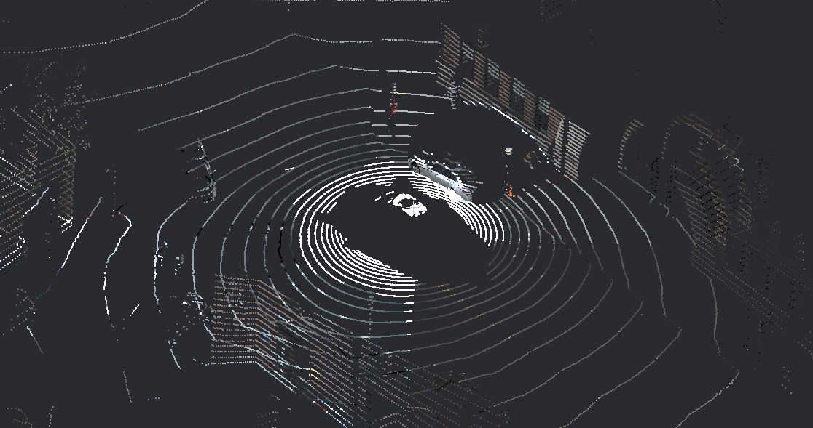

# Colorize Lidar Point clouds

## Description

Python scripts to colorize lidar points by projecting colors from synchronized camera images. By combining camera images with lidar data, we can enhance the lidar point cloud by assigning colors to the points based on the corresponding camera image pixels. This makes processing, visualize and labeling the point cloud much easier.

[This article](https://medium.com/mindkosh/colorize-lidar-point-clouds-with-camera-images-4af69cb3efea) explains our process of colorizing lidar point clouds.



## Installation

1. Clone the repository:

    ```bash
    git clone https://github.com/Shikherneo2/colorize-lidar-pointcloud.git
    ```

2. Install the required dependencies:

    ```bash
    pip install -r requirements.txt
    ```

## Usage

1. Place your camera images, camera parameters and lidar data in the appropriate directories. In the scripts, we use example images and lidar files from the nuscenes dataset in the examples_files directory

2. Run the main script:

    ```bash
    python colorize_lidar.py
    ```
3. Aternatively, you can run the code interactively using the iPython notebook    

3. The colorized lidar point cloud will be saved as an output point cloud file in PLY format.

## Specifying camera parameters
To specify the camera parameters, add them to a json file and reference it in the python script. The following parameters are supported. An example parameters file for the nuscenes dataset is included in the examples directory.

1. device_id (required): A device ID that identifies a camera. This is also used to specify that camera's output image in the python script.
2. intrinsic (required): Intrinsic parameters of the camera in the format - [*fx, fy, cx, cy*]
3. extrinsic (required): A 4x4 matrix specifying the transformation matrix to transform points in lidar reference frame to the camera reference frame.
4. cameraModel (required): Either *PINHOLE* or *FISHEYE*
5. mirrorParameter : The mirror parameter for fisheye cameras. If you are unaware, set it to 0.
6. distortion (optional):  Distortion parameters according to the Brown distortion model in this format - [*k1, k2, p1, p2*]
7. x_is_z (optional): Set this to true if the x axis of your lidar point cloud should be considered as Z. Ignore this unless you know what you are doing.

## Mindkosh
Mindkosh is a labeling platform specially built to handle 3D data like Lidar point clouds. Here are some of the most salient features:
1. Label both point clouds and supporting camera images with consistent IDs across sensors and time
2. Interpolation to predict cuboids for subsequent frames.
3. 1-click cuboid annotation.
4. Quality report with utomatically calculated Quality metrics.
5. Detailed Project reports with time and labeled object analysis.

You can learn more about the [point cloud annotation platform here](https://mindkosh.com/annotation-platform/lidar-annotation-tool.html).

## License

This project is licensed under the [MIT License](LICENSE).
